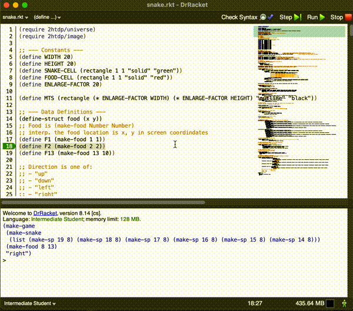

# Snake Game in Racket

A classic Snake game implementation using Racket and the 2htdp/universe library.

## Game Description

In this implementation of Snake, you control a snake that moves around a 20x20 grid. The goal is to eat the red food pieces while avoiding collisions with the snake's own body and the game boundaries.

## Features

- Classic snake movement mechanics
- Food generation at random locations
- Score increases when food is eaten
- Snake grows longer with each food piece eaten
- Game over on self-collision
- Smooth controls with arrow keys
- Reset functionality with 'r' key

## Controls

- **↑**: Move snake up
- **↓**: Move snake down
- **←**: Move snake left
- **→**: Move snake right
- **r**: Reset game

## Requirements

- DrRacket or any Racket environment
- 2htdp/universe library
- 2htdp/image library

## How to Run

1. Open the `snake.rkt` file in DrRacket
2. Click "Run" or press Ctrl+R (Cmd+R on Mac)

## Game Rules

- The snake moves continuously in the current direction
- Eating food (red squares) makes the snake grow longer
- Game ends if the snake collides with itself
- The snake can wrap around the screen edges

## Implementation Details

The game is built using:
- A tick-based game loop (updates every 0.1 seconds)
- Functional programming principles
- Data structures for:
  - Snake position (list of coordinates)
  - Food position
  - Game state
  - Direction

## Demo

### Gameplay Preview

